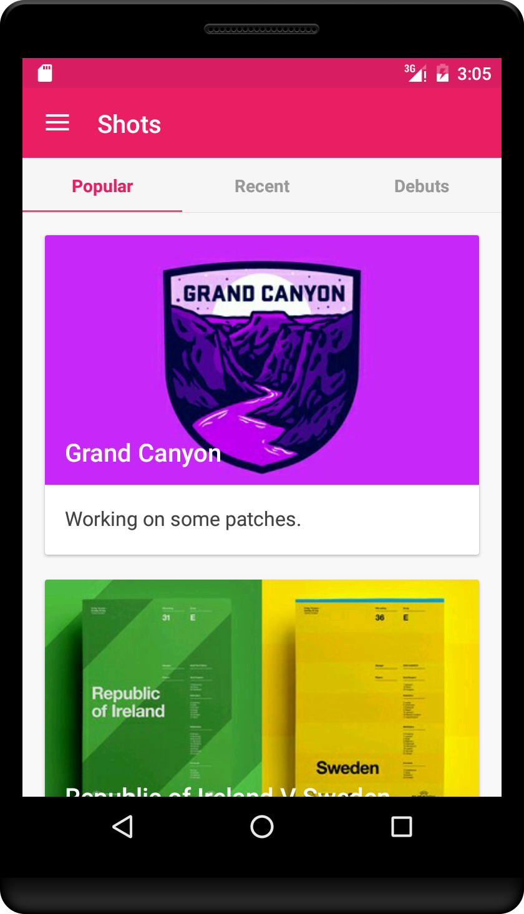

# Dribbbler


A  Dribbble client with  MVP+Repository pattern , RxJava ,Retrofit , Dagger . 

## Architecture

You can check out the different branches for more information .

- [basic/](https://github.com/81813780/Dribbbler/tree/basic) - Basic MVP architecture with Retrofit .
- [rxjava/](https://github.com/81813780/Dribbbler/tree/rxjava) - Basic MVP architecture with Retrofit , RxJava .
- [rxjava-dagger/](https://github.com/81813780/Dribbbler/tree/rxjava-dagger) - Basic MVP architecture with Retrofit , RxJava , Dagger2 .
- rxjava-loaders/ -  in the future .
- rxjava-databinding/ - in the future .

## Screenshots

   


## License
```
Copyright 2015 jack wang

Licensed under the Apache License, Version 2.0 (the "License");
you may not use this file except in compliance with the License.
You may obtain a copy of the License at

   http://www.apache.org/licenses/LICENSE-2.0

Unless required by applicable law or agreed to in writing, software
distributed under the License is distributed on an "AS IS" BASIS,
WITHOUT WARRANTIES OR CONDITIONS OF ANY KIND, either express or implied.
See the License for the specific language governing permissions and
limitations under the License.
```
